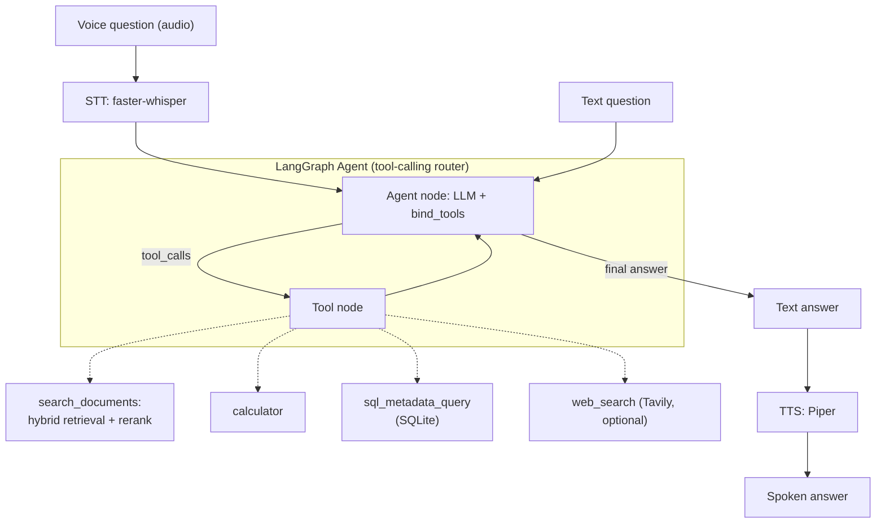

# DocRAG - Voice-Enabled Agentic RAG Assistant

Private-document RAG over PDFs, upgraded from a plain text chatbot into a
**voice-enabled, agentic** assistant that runs entirely on local models.

- Ask by text or by voice; hear the answer spoken back.
- Hybrid retrieval (BM25 + dense) with cross-encoder reranking for grounded,
  low-hallucination answers.
- A LangGraph agent that decides between searching your documents, doing math,
  querying document metadata, or (optionally) searching the web.
- Measured quality with RAGAS; optional LangSmith tracing.
- Nothing leaves your machine (Ollama + local embeddings + local speech).

## Architecture



See [docs/ARCHITECTURE.md](docs/ARCHITECTURE.md) for detailed pipeline diagrams
(ingestion, retrieval + rerank, agent routing, voice, evaluation).

## Stack

| Layer | Technology |
|-------|------------|
| API | FastAPI + Uvicorn (`app.py`) |
| UI | Streamlit (`streamlit_app.py`), browser mic via `st.audio_input` |
| LLM | Ollama (OpenAI-compatible), default `qwen2.5:3b` |
| Embeddings | `BAAI/bge-small-en-v1.5` (sentence-transformers) |
| Chunking | Semantic chunking (fallback: recursive) |
| Retrieval | Hybrid BM25 + Chroma dense via `EnsembleRetriever` |
| Reranking | Cross-encoder `ms-marco-MiniLM-L-6-v2` |
| Agent | LangGraph tool-calling agent |
| Tools | document search, calculator, SQL metadata, web search (Tavily) |
| Voice | faster-whisper (STT) + Piper (TTS) |
| Evaluation | RAGAS (local judge) + optional LangSmith |
| Deploy | Docker Compose (UI + API + Ollama) |

## Setup

```bash
cd RAG_proj
python -m venv .venv
# Windows
.venv\Scripts\activate
# macOS/Linux: source .venv/bin/activate

pip install -r requirements.txt
```

Start Ollama (required for answers) and pull a tool-capable model:

```bash
ollama serve
ollama pull qwen2.5:3b
```

Copy `.env.example` to `.env` to override defaults (model, embeddings, weights,
voice, web search, tracing).

## Run the UI

```bash
streamlit run streamlit_app.py
```

Open http://localhost:8501 - upload a PDF, then either type a question and click
**Ask**, or expand **Ask by voice** to record/upload an audio question and hear
the answer spoken back.

## Run the API

```bash
uvicorn app:app --host 0.0.0.0 --port 5000
# or: python app.py
```

Interactive docs at http://localhost:5000/docs.

| Method | Path | Body |
|--------|------|------|
| GET | `/health` | - |
| POST | `/ingest` | multipart field `file` (PDF) |
| POST | `/chat` | JSON `{ "message": "..." }` |
| POST | `/voice-chat` | multipart field `file` (audio); returns transcript, answer, and base64 WAV |

## Offline ingest CLI

```bash
python ingest.py path/to/document.pdf
```

## Retrieval quality: evaluation with RAGAS

Generate the sample corpus and run the evaluation (Ollama must be running):

```bash
python scripts/make_sample_docs.py     # writes 3 sample PDFs to data/eval/docs/
python -m src.evaluation                # scores 22 Q&A pairs, writes docs/eval_results.md
```

RAGAS measures **faithfulness** (grounding / hallucination), **answer
relevancy**, **context precision**, and **context recall** using a fully local
judge (the Ollama model + local embeddings). Set `EVAL_LLM_MODEL` to a larger
local model for more reliable judging. Results are written to
[docs/eval_results.md](docs/eval_results.md).

## Agentic demo

```bash
python scripts/demo_agentic_query.py
```

Ingests the sample documents, then asks *"How many documents have been ingested,
and what is 15% of that number?"* - which forces the agent to chain the
`sql_metadata_query` and `calculator` tools.

## Optional: web search

Set `TAVILY_API_KEY` (free tier at tavily.com) to enable the `web_search` tool.
When unset, the tool is not registered and the agent stays documents-first.

## Optional: LangSmith tracing

```bash
export LANGCHAIN_TRACING_V2=true
export LANGCHAIN_API_KEY=ls-...
export LANGCHAIN_PROJECT=docrag
```

The app warns (but does not fail) if tracing is enabled without a key.

## Docker

Runs Streamlit, FastAPI, and Ollama together. Inside Compose the LLM URL is
`http://ollama:11434/v1`.

```bash
docker compose up --build
```

First start pulls `qwen2.5:3b` via the `ollama-init` service (can take several
minutes). Piper voices and Whisper/embedding models are cached in the mounted
`./data` and `hf_cache` volumes.

| Service | URL |
|---------|-----|
| Streamlit UI | http://localhost:8501 |
| FastAPI | http://localhost:5000 |
| Ollama | http://localhost:11434 |

```bash
docker compose down
```

## Recording a demo (manual)

The voice/agent flows make a great short demo video/GIF. Suggested script:

1. Upload a PDF, ask a text question, show the grounded answer.
2. Expand **Ask by voice**, record a spoken question, play the spoken answer.
3. Run `python scripts/demo_agentic_query.py` to show multi-tool reasoning.

Capture with any screen recorder (e.g. OBS, ScreenToGif) - this step is manual.

## Project layout

```
app.py                 FastAPI API (/health /ingest /chat /voice-chat)
streamlit_app.py       Streamlit UI (text + voice)
ingest.py              CLI ingest
scripts/
  make_sample_docs.py  Generate sample eval PDFs (dev)
  run_eval.py          RAGAS evaluation entry point
  demo_agentic_query.py Multi-tool agent demo
src/
  config.py            Central configuration (env-driven)
  embeddings.py        Shared bge embedding provider
  ingest.py            PDF load + semantic/recursive chunking
  retrieval.py         Hybrid BM25 + dense ensemble
  reranker.py          Cross-encoder reranking
  rag.py               RAG chain + agent routing
  llm.py               Ollama chat client
  metadata.py          SQLite document-metadata store
  evaluation.py        RAGAS harness
  voice/
    stt.py             faster-whisper speech-to-text
    tts.py             Piper text-to-speech
  agent/
    graph.py           LangGraph tool-calling agent
    tools/             search_documents, calculator, sql_metadata, web_search
data/
  raw/                 uploaded PDFs
  chroma/              vector store
  eval/                sample PDFs + qa_dataset.json
  voice/               downloaded Piper voices (gitignored)
```
