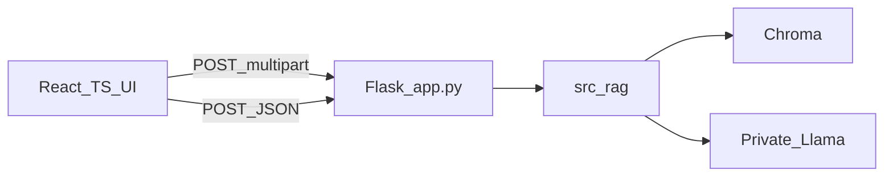

# Flask API + React/TypeScript RAG UI

## Settled stack

- **Use:** Python, Flask API, React, TypeScript, Docker (later if needed)
- **Skip for now:** Streamlit, Snowflake, Redis, SQL, Azure

Existing RAG core stays as-is: [src/rag.py](src/rag.py), [src/ingest.py](src/ingest.py), [src/llm.py](src/llm.py), [src/config.py](src/config.py).

## 1. Flask API — [app.py](app.py)

Wire empty stub to `src.rag`:

- Call `init_llm()` once at startup
- Enable CORS for the Vite dev origin (`http://localhost:5173`)
- Endpoints:
  - `GET /health` — `{ "status": "ok" }`
  - `POST /ingest` — multipart PDF → save under `data/raw/` → `process_document(path)` → `{ "ok": true, "filename": "..." }`
  - `POST /chat` — JSON `{ "message": "..." }` → `process_prompt(message)` → `{ "answer": "..." }`
- Return clear 400/503 if no document loaded or bad input
- Add `flask-cors` to [requirements.txt](requirements.txt)

## 2. Ingest CLI — [ingest.py](ingest.py)

Simple script: `init_llm()` then `process_document(sys.argv[1])` for offline/indexing without the UI.

## 3. React + TypeScript UI — `frontend/`

Scaffold with Vite (`react-ts`):

- Single chat page: PDF upload → call `/ingest`; message list + input → call `/chat`
- Env: `VITE_API_URL=http://localhost:5000`
- Keep UI minimal and functional (upload status, loading state, error text)—no extra auth or multi-session features

## 4. Run flow

1. Start Llama endpoint (existing `LLAMA_BASE_URL`)
2. `flask --app app run` (or `python app.py`) on port 5000
3. `cd frontend && npm run dev` on 5173

Docker deferred; add later only if packaging for demos.

## Out of scope

Streamlit, Snowflake, Redis, SQL persistence, Azure hosting.
